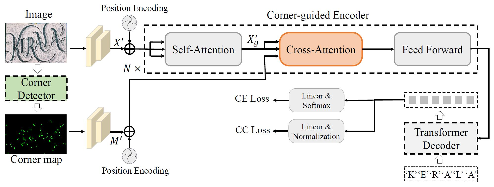
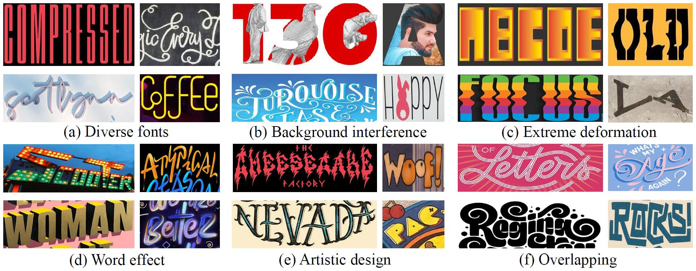

# Toward Understanding WordArt: Corner-Guided Transformer for Scene Text Recognition （ECCV 2022 Oral）
The official code of CornerTransformer (ECCV 2022, Oral).

This work focuses on a new challenging task of artistic text recognition. To tackle the difficulties of this task, we introduce the corner point map as a robust representation for the artistic text image and present the corner-query cross-attention mechanism to make the model achieve more accurate attention. We also design a character contrastive loss to learn the invariant features of characters, leading to tight clustering of features. In order to benchmark the performance of different models, we provide the WordArt dataset.
<div align="center">
  
</div>

## Runtime Environment
This repo depends on [PyTorch](https://pytorch.org/), [MMCV](https://github.com/open-mmlab/mmcv), [MMDetection](https://github.com/open-mmlab/mmdetection) and [MMOCR](https://github.com/open-mmlab/mmocr).
Below are quick steps for installation.
Please refer to [MMOCR Install Guide](https://mmocr.readthedocs.io/en/latest/install.html) for more detailed instruction.

```shell
conda create -n wordart python=3.7 -y
conda activate wordart
conda install pytorch==1.10 torchvision cudatoolkit=11.3 -c pytorch
pip install mmcv-full -f https://download.openmmlab.com/mmcv/dist/cu113/torch1.10.0/index.html
pip install mmdet
git clone https://github.com/xdxie/WordArt.git
cd WordArt
pip install -r requirements.txt
pip install -v -e .
export PYTHONPATH=$(pwd):$PYTHONPATH
pip install -r requirements/albu.txt
```

## Training
For distributed training on multiple GPUs, please use
```shell
./tools/dist_train.sh ${CONFIG_FILE} ${WORK_DIR} ${GPU_NUM} [PY_ARGS]
```
For training on a single GPU, please use
```shell
python tools/train.py ${CONFIG_FILE} [ARGS]
```
For example, we use this script to train the model:
```shell
./tools/dist_train.sh configs/textrecog/corner_transformer/corner_transformer_academic.py outputs/corner_transformer/ 4
```

## Evaluation
For distributed evaluating on multiple GPUs, please use
```shell
./tools/dist_test.sh ${CONFIG_FILE} ${CHECKPOINT_FILE} ${GPU_NUM} [PY_ARGS]
```
For evaluating on a single GPU, please use
```shell
python tools/test.py ${CONFIG_FILE} ${CHECKPOINT_FILE} [ARGS]
```
For example, we use this script to evaluate the model performance:
```shell
CUDA_VISIBLE_DEVICES=0 python tools/test.py outputs/corner_transformer/corner_transformer_academic.py outputs/corner_transformer/latest.pth --eval acc
```

## WordArt Dataset
The WordArt dataset consists of 6316 artistic text images with 4805 training images and 1511 testing images.  The dataset is available at [Google Drive](https://drive.google.com/file/d/1SanxRwTxd2q7UrQxlbC3BmP3nhFXwZ3g/view?usp=sharing).
<div align="center">
  
</div>

## Results
|Model|IC13|SVT|IIIT|IC15|SVTP|CUTE|WordArt|
|-|-|-|-|-|-|-|-|
|CornerTransformer|96.4|94.6|95.9|86.3|91.5|92.0|70.8|

## Citation
Please cite the following paper when using the WordArt dataset or this repo.

```
@article{xie2022toward,
  title={Toward Understanding WordArt: Corner-Guided Transformer for Scene Text Recognition},
  author={Xie, Xudong and Fu, Ling and Zhang, Zhifei and Wang, Zhaowen and Bai, Xiang},
  booktitle={ECCV},
  year={2022}
}
```

## Acknowledgement
This repo is based on [MMOCR](https://github.com/open-mmlab/mmocr). We appreciate this wonderful open-source toolbox.
